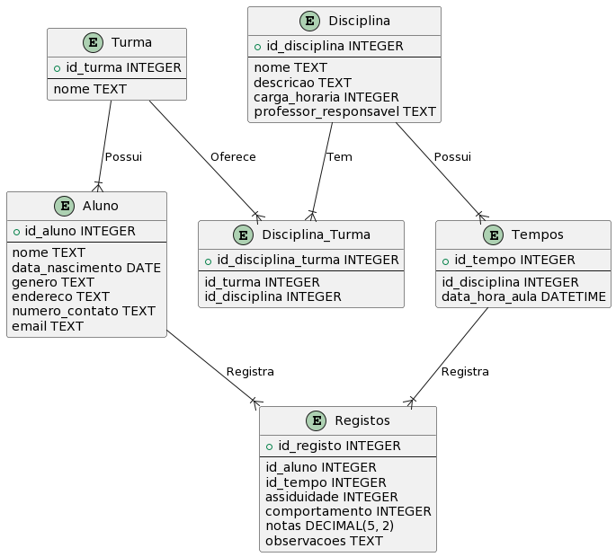

# API for 'Diario do Professor'

This API is a RESTful API built with Node.js, Express and MySQL.

This API has the objective to manage all classes of a teacher. It will be possible to manage students, classes, subjects, times and records. And in the end of the year, the teacher will be able to generate a report with all the information of the students.

## Database
### Entity Relationship
#### Phrases

```
Relações entre as entidades:
- Uma turma tem vários alunos (turma 1:N aluno)
- Um aluno pertence a uma turma (aluno N:1 turma)
- Uma turma tem várias disciplinas (turma 1:N disciplina)
- Uma disciplina tem varias turmas (disciplina 1:N turma)
- Uma disciplina tem vários tempos (disciplina 1:N tempos)
- Um tempo pertence a uma disciplina (tempo N:1 disciplina)
- Um aluno tem vários registos (aluno 1:N registos)
- Um registo pertence a um aluno (registo N:1 aluno)
- Um tempo tem vários registos (tempo 1:N registos)
- Um registo pertence a um tempo (registo N:1 tempo)
```

#### Diagram


## Endpoints (To Implement)
### Alunos
```
- GET /api/alunos
- GET /api/alunos/:id
- POST /api/alunos
- PUT /api/alunos/:id
- DELETE /api/alunos/:id
```
### Turmas
```
- GET /api/turmas
- GET /api/turmas/:id
- POST /api/turmas
- PUT /api/turmas/:id
- DELETE /api/turmas/:id
```

### Disciplinas
```
- GET /api/disciplinas
- GET /api/disciplinas/:id
- POST /api/disciplinas
- PUT /api/disciplinas/:id
- DELETE /api/disciplinas/:id
```

### Tempos
```
- GET /api/tempos
- GET /api/tempos/:id
- POST /api/tempos
- PUT /api/tempos/:id
- DELETE /api/tempos/:id
```

### Registos
```
- GET /api/registos
- GET /api/registos/:id
- POST /api/registos
- PUT /api/registos/:id
- DELETE /api/registos/:id
```

### Auth
```
- POST /api/auth/login (Token JWT with 2h expiration)
    - username
    - password
- POST /api/auth/register
- POST /api/auth/logout
- POST /api/auth/refresh
- POST /api/auth/forgot-password
- POST /api/auth/reset-password
```
## Endpoints (Implemented)
